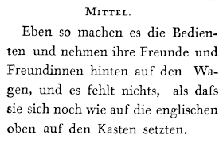
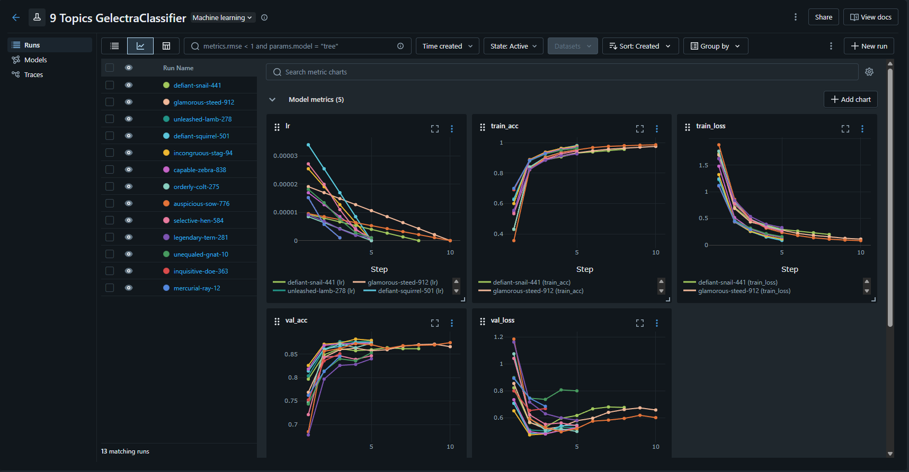
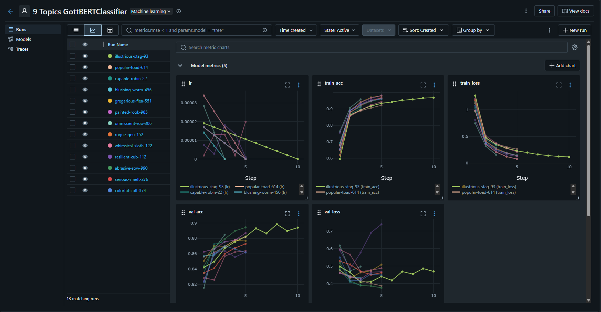
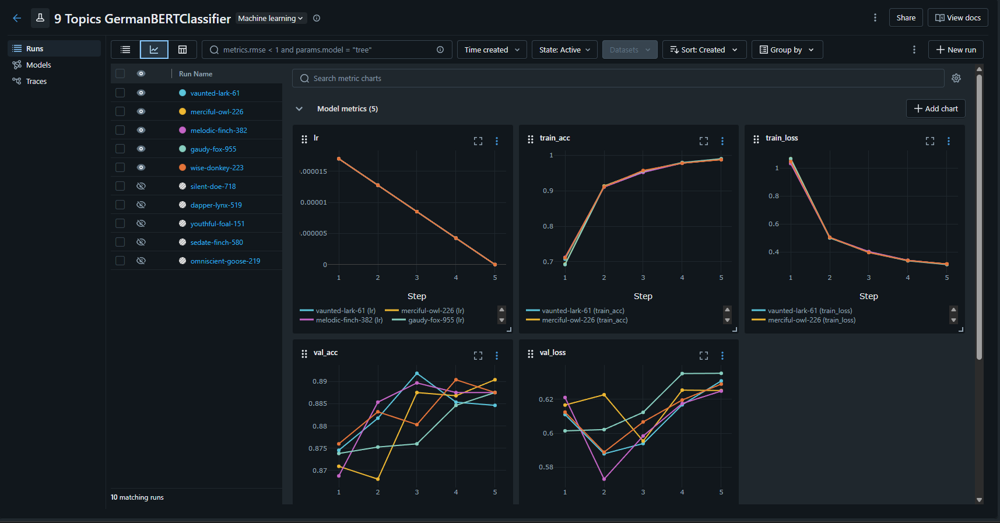

# This is a Deep Learning Invididual Task for German Text Classification

<p align="center">
  
</p>

# First Pre-trained models

I started training pre-trained models such as **Gelectra** and **GottBert**. 

**Gelectra** achieved **87.0 accuracy** at max.

<p align="center">
  
</p>

While, **GottBert** achieved **89.9 accuracy**.

<p align="center">
  
</p>

I reccomend this [video](https://youtu.be/l8pRSuU81PU?t=4938&si=4t2rQgNW9zWYfe-8), in particular Section 2, which is about optimizations from [Andrej Karpathy](https://en.wikipedia.org/wiki/Andrej_Karpathy) to understand more about optimizations for training ML models. This file [train.py](train.py) is for fast training.

# GermanBert

I downloaded GermanBert from [Hugging Face](https://huggingface.co/google-bert/bert-base-german-cased) - achieved **90.679 accuracy** on Kaggle.

After adding ensemble with different random seeds achieved **90.838 accuracy**

<p align="center">
  
</p>

Related [paper](https://arxiv.org/pdf/1810.04805). Reading the introduction would provide a high-level understanding.

In these files [train.py](train.py), [train_ensemble.py](train_ensemble.py) and [create_ensemble_submission.py](create_ensemble_submission.py) can be found the most work relevant to this part.

# Heavy Weapon for GottBert Large

Here at [Runpod](https://www.runpod.io/) you can rent some GPUs for acceptable price. 

I was working on **RTX 2000 Ada 16 GB** for training larger model. Achieved only **89.708 accuracy** on Kaggle.

# Additional Work

## CleanLab - Finding Label Issues

[Cleanlab](https://cleanlab.ai/) is a platform and a open-source [library](https://github.com/cleanlab/cleanlab) which is designed to help find label issues and support annotators, making it highly relevant to the data-centric AI approach.

I would reccomend to read briefly their [website](https://dcai.csail.mit.edu/) with Lectures and Labs hosted by [MIT](https://www.mit.edu/)

Files related to this part are [find_label_issues.py](find_label_issues.py)

Usage:  
```python
python find_label_issues.py
```

## Confusion Matrix

Essentially, just added confusion matrix and precision, recall and f1 metrics per class in this file [create_confusion_matrix.py](create_confusion_matrix.py)

## Env Configuration

If you are going to use ***RunPod*** containers, run these commands first:    

```bash
sudo apt-get remove --purge python3-blinker
```

```bash
sudo apt-get remove --purge python3-cryptography
```